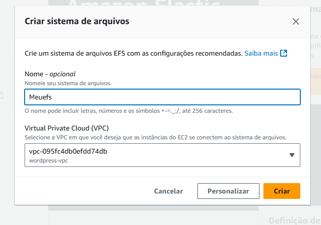
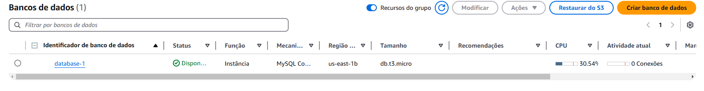
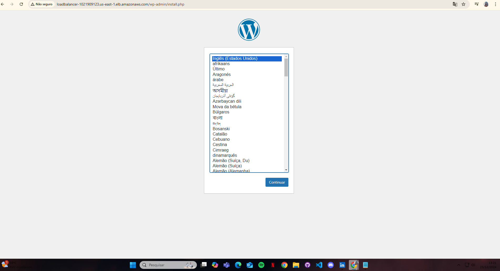
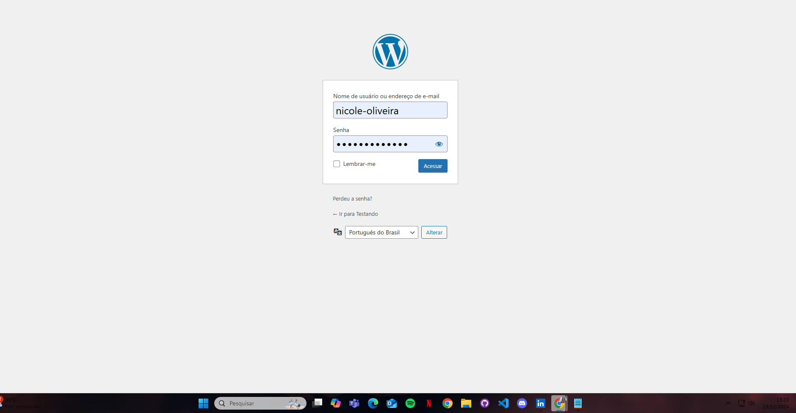
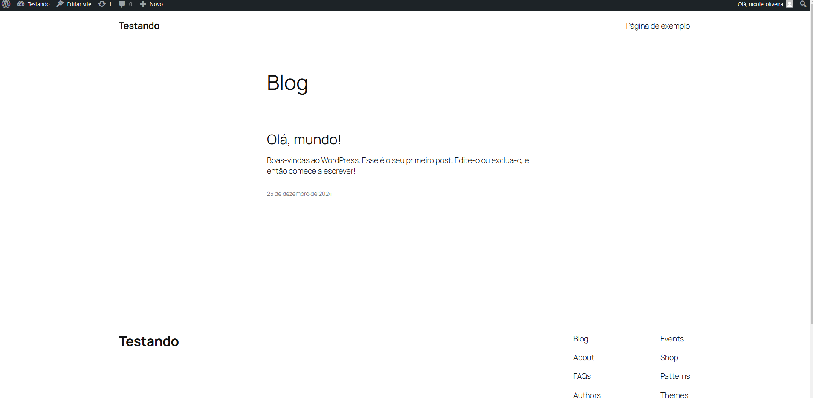

# WordPress na AWS

## Deploy de Aplicação WordPress no AWS EC2 com Docker e EFS
Este projeto configura e executa uma aplicação WordPress utilizando Amazon EC2, VPC, Load Balancer, Subnets, Security groups, Bastion Host, EFS e RDS.


## Arquitetura do Sistema

- **EC2:** Servidores onde a aplicação WordPress é executada.
- **Load Balancer:** Distribui o tráfego entre as instâncias EC2.
- **EFS:** Sistema de arquivos para armazenamento compartilhado.
- **RDS:** Banco de dados relacional para armazenamento dos dados do WordPress.
- **AutoScaling:** Ajusta automaticamente o número de instâncias EC2 em resposta à demanda, garantindo desempenho e eficiência de custos.

## Pré-requisitos

- Conta AWS
- Editor de texto de sua preferência

## Configuração e Instalação

### Passo 1: Configurar a VPC

1. **Criando a VPC:**
  - Configure a VPC conforme necessário para seu projeto.
  - Crie as sub-redes (2 públicas e 2 privadas).
  - Crie tabelas de rotas e associe ás sub-redes.


    


   ----


### Passo 2: Criar Grupos de Segurança

 

#### Grupo Público

- Tipo: Entrada > Protocolo: TCP > Porta: 80 > Origem: 0.0.0.0/0
- Tipo: Entrada > Protocolo: TCP > Porta: 443 > Origem: 0.0.0.0/0
- Tipo: Entrada > Protocolo: TCP > Porta: 22 > Origem: 0.0.0.0/0
- Tipo: Saída > Protocolo: vazio > Porta: vazio > Origem: Todo o tráfego permitido


#### Grupo Privado 
- Tipo: Entrada > Protocolo: TCP > Porta: 3306 > Origem: 0.0.0.0/0
- Tipo: Entrada > Protocolo: TCP > Porta: 22 > Origem: 0.0.0.0/0
- Tipo: Entrada > Protocolo: TCP > Porta: 2049 > Origem: 0.0.0.0/0
- Tipo: Entrada > Protocolo: TCP > Porta: 443 > Origem: Grupo Público
- Tipo: Entrada > Protocolo: TCP > Porta: 80 > Origem: Grupo Público
- Tipo: Saída vazio > Protocolo: vazio > Todo o tráfego permitido


---


### Passo 3: Criar Instância EC2 

1. **Configurar Instância EC2:** 
   - Abra o painel da EC2 e selecione a opção "executar instância", em seguida selecione as opções abaixo: 

     - Escolha um nome
     - Tipo de instância: Free Tier (t2.micro)
     - AMI: Amazon Linux 2 
     - VPC: Selecione a VPC criada no primeiro passo 
     - Crie um par de chaves (caso ja tenha criado, utilize uma chave existente).
     - Em configurações de rede, selecione a subnet privada e mantenha o ip público desabilitado. 
     - Crie um grupo de segurança, escolha o nome e defina as regras (caso já tenha criado, utilize um grupo existente).
     
     - Em detalhes avançados, adicione o User Data:
       ```bash
       #!/bin/bash 

       # Atualizar o sistema
       sudo yum update -y 

       # Instalar Docker
       sudo yum install docker -y

       # Iniciar e habilitar Docker
       sudo systemctl start docker
       sudo systemctl enable docker

       # Adicionar ec2-user ao grupo Docker
       sudo usermod -aG docker ec2-user
       newgrp docker

       # Instalar Docker Compose
       sudo curl -L "https://github.com/docker/compose/releases/latest/download/docker-compose-$(uname -s)-$(uname -m)" -o /usr/local/bin/docker-compose
       sudo chmod +x /usr/local/bin/docker-compose

       # Criar diretório para o WordPress
       sudo mkdir /home/ec2-user/wordpress

       # Criar arquivo docker-compose.yml
       cat <<EOF > /home/ec2-user/wordpress/docker-compose.yml
       services:
         wordpress:
           image: wordpress:latest
           restart: always
           ports:
             - "8080:80"
           environment:
             WORDPRESS_DB_HOST: database-1.clgmyqs0asc5.us-east-1.rds.amazonaws.com:3306
             WORDPRESS_DB_USER: admin
             WORDPRESS_DB_PASSWORD: nicole1010
             WORDPRESS_DB_NAME: bancodd
           volumes:
             - /mnt/efs:/var/www/html
       EOF

       # Montar o sistema de arquivos EFS
       sudo mount -t nfs4 -o nfsvers=4.1,rsize=1048576,wsize=1048576,hard,timeo=600,retrans=2,noresvport fs-053809c0e221c545b.efs.us-east-1.amazonaws.com:/ efs

       # Subir os serviços com Docker Compose
       sudo docker-compose -f /home/ec2-user/wordpress/docker-compose.yml up -d
       ```

### Passo 4: Configurar Load Balancer

1. **Criar Load Balancer:**
   - No console da AWS, e clique em criar Load Balancer.
   - Escolha um nome para o seu Load Balancer e selecione a sua VPC.
   - Vincule ao grupo de segurança público.
   - Na opção Listeners e roteamento, selecione (HTTP, porta 80).
   - Em verificações de integridade, selecione o protocolo ping (HTTP e porta 80) e caminho de ping (/wp-admin/install.php).


### Passo 5: Criar e Configurar EFS
    
1. **Acesse o serviço EFS no console AWS:**
   - Vincular à VPC.
   - Configurar armazenamento compartilhado entre as instâncias EC2.


   
   
   

<br/> 
<hr/>
<br/>

### Passo 6: Criar e Configurar RDS
    
1. **Acesse o painel RDS no console da AWS:**
   

   - Clique em criar banco de dados
   - Escolha opção MySQL
   - Configurações Free Tier.
   - Definir usuário, senha, nome do banco.
   - Vincular à VPC, grupo de segurança, subnets privadas.


        Aqui está o seu RDS criado e configurado para uso.
   
 
<br/> 
<hr/>
<br/>


### Passo 7: Configurar Auto Scaling
1. No painel AWS, acesse o serviço Auto Scaling


- Criar Auto Scaling Group:
- Escolha um nome para o seu AutoScaling
- Vincular a um Launch Configuration ou Template.
- Definir capacidades inicial, mínima e máxima.
- Associar ao Load Balancer existente.


---
### Conclusão
Após concluir todos os passos acima, configure o seu wordpress selecionando o idioma, escolha o seu login e senha e acesse o seu blog.









<h2 align="center"></h2>
 
<p align="center">
  Este projeto foi desenvolvido por <a href="https://github.com/nicoleevelyn7">Nicole Oliveira</a>. Atribuído pela <a href="https://compass.uol/pt/home/">Compass.Uol</a> e orientado por Thiago Geremias de Oliveira.
</p>