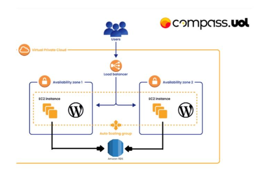

# WordPress na AWS

## Deploy de Aplicação WordPress no AWS EC2 com Docker e EFS
Este projeto configura e executa uma aplicação WordPress utilizando Amazon EC2, Load Balancer, EFS e RDS.



## Arquitetura do Sistema

- **EC2:** Servidores onde a aplicação WordPress é executada.
- **Load Balancer:** Distribui o tráfego entre as instâncias EC2.
- **EFS:** Sistema de arquivos para armazenamento compartilhado.
- **RDS:** Banco de dados relacional para armazenamento dos dados do WordPress.

## Pré-requisitos

- Conta AWS
- AWS CLI configurada
- Docker e Docker Compose instalados

## Configuração e Instalação

### Passo 1: Configurar a VPC

1. **Criar uma VPC:**
   - Configure a VPC conforme necessário para seu projeto.
    

### Passo 2: Criar Grupos de Segurança


 

#### Grupo Público

| Tipo    | Protocolo | Porta | Origem                   |
| ------- | --------- | ----- | ------------------------ |
| Entrada | TCP       | 80    | 0.0.0.0/0                |
| Entrada | TCP       | 443   | 0.0.0.0/0                |
| Entrada | TCP       | 22    | 0.0.0.0/0                |
| Saída   | -         | -     | Todo o tráfego permitido |

 #### Grupo Privado 
 | Tipo    | Protocolo | Porta | Origem                   |
 | ------- | --------- | ----- | ------------------------ |
 | Entrada | TCP       | 3306  | 0.0.0.0/0                |
 | Entrada | TCP       | 22    | 0.0.0.0/0                |
 | Entrada | TCP       | 2049  | 0.0.0.0/0                |
 | Entrada | TCP       | 443   | Grupo Público            |
 | Entrada | TCP       | 80    | Grupo Público            |
 | Saída   | -         | -     | Todo o tráfego permitido |

 ### Passo 3: Criar Instância EC2 
 
 1. **Configurar Instância EC2:** 
 - Abra o painel da EC2 e selecione a opção "executar instância", em seguida selecione as opções abaixo: 
 - Tags: Utilize as tags atribuídas
  - Tipo de instância: Free Tier (t2.micro) - AMI: Amazon Linux 2 
  - VPC: Use a VPC criada anteriormente 
  - User Data:
  ```bash
   #!/bin/bash 

# Atualizar o sistema
sudo yum update -y 

# Instalar Docker
sudo yum install docker -y

# Iniciar e habilitar Docker
sudo systemctl start docker
sudo systemctl enable docker

# Adicionar ec2-user ao grupo Docker
sudo usermod -aG docker ec2-user
newgrp docker

# Instalar Docker Compose
sudo curl -L "https://github.com/docker/compose/releases/latest/download/docker-compose-$(uname -s)-$(uname -m)" -o /usr/local/bin/docker-compose
sudo chmod +x /usr/local/bin/docker-compose

# Criar diretório para o WordPress
sudo mkdir /home/ec2-user/wordpress

# Criar arquivo docker-compose.yml
cat <<EOF > /home/ec2-user/wordpress/docker-compose.yml
services:
  wordpress:
    image: wordpress
    restart: always
    ports:
      - 80:80
    environment:
      WORDPRESS_DB_HOST: database-1.clgmyqs0asc5.us-east-1.rds.amazonaws.com:3306
      WORDPRESS_DB_USER: admin
      WORDPRESS_DB_PASSWORD: nicole1010
      WORDPRESS_DB_NAME: bancodd
    volumes:
      - /mnt/efs:/var/www/html
EOF

# Montar o sistema de arquivos EFS
sudo mount -t nfs4 -o nfsvers=4.1,rsize=1048576,wsize=1048576,hard,timeo=600,retrans=2,noresvport fs-053809c0e221c545b.efs.us-east-1.amazonaws.com:/ efs

# Subir os serviços com Docker Compose
sudo docker-compose -f /home/ec2-user/wordpress/docker-compose.yml up -d 


  ### Passo 4: Configurar Load Balancer

      - Criar Load Balancer
      - Configurar com Application Load Balancer
      - Vincular ao grupo de segurança público
      - Configurar Listeners (HTTP, porta 80)
      - Testar verificações de integridade


  ### Passo 5:Criar e configurar EFS
    
      - Criar EFS
      - Vincular à VPC
      - Configurar armazenamento compartilhado entre as intâncias EC2.


  ### Passo 6: Criar e configurar RDS
    
      - Criar banco de dados MySQL
      - Configurações Free Tier
      - Definir usuário, senha, nome do banco
      - Vincular à VPC, grupo de segurança, subnets privadas

  ### Passo 6: Configurar Docker e WordPress

    docker_compose:
      wordpress:
        image: wordpress:latest
        restart: always
        ports:
          - "8080:80"
        environment:
          WORDPRESS_DB_HOST: database-1.clgmyqs0asc5.us-east-1.rds.amazonaws.com:3306
          WORDPRESS_DB_USER: admin
          WORDPRESS_DB_PASSWORD: nicole1010
          WORDPRESS_DB_NAME: bancodd
        volumes:
          - wordpress:/var/www/html
      volumes:
        wordpress:


  ### Passo 7: Configurar Auto Scaling
    
      - Criar Auto Scaling Group
      - Vincular a um Launch Configuration ou Template
      - Definir capacidades inicial, mínima e máxima
      - Associar ao Load Balancer existente**