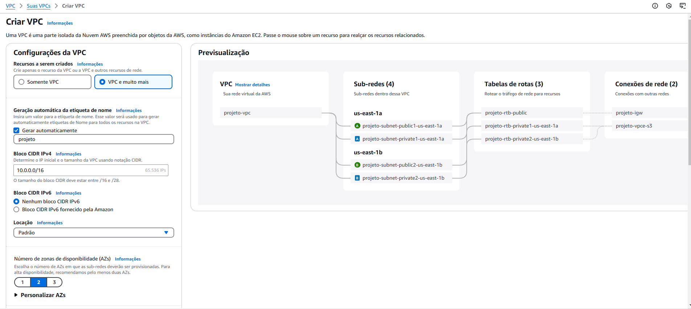
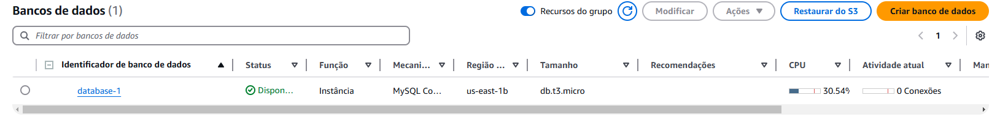

## Nome do projeto
Este projeto configura e executa uma aplicação WordPress utilizando Amazon EC2, Load Balancer, EFS e RDS.
# WordPress na AWS

  <!-- Adicione sua imagem aqui -->


## Arquitetura do Sistema

- **EC2:** Servidores onde a aplicação WordPress é executada.
- **Load Balancer:** Distribui o tráfego entre as instâncias EC2.
- **EFS:** Sistema de arquivos para armazenamento compartilhado.
- **RDS:** Banco de dados relacional para armazenamento dos dados do WordPress.

## Pré-requisitos

- Conta AWS
- AWS CLI configurada
- Docker e Docker Compose instalados

## Configuração e Instalação

### Passo 1: Configurar a VPC

1. **Criar uma VPC:**
   - Configure a VPC conforme necessário para seu projeto.
    

### Passo 2: Criar Grupos de Segurança


 
1. **Grupo Público:**
   - **Portas de Entrada:**
     - HTTP (TCP): 80 - 0.0.0.0/0
     - HTTPS (TCP): 443 - 0.0.0.0/0
     - SSH (TCP): 22 - 0.0.0.0/0
   - **Saída:**
     - Todo o tráfego permitido.

2. **Grupo Privado:**
   - **Portas de Entrada:**
     - MySQL/Aurora (TCP): 3306 - 0.0.0.0/0
     - SSH (TCP): 22 - 0.0.0.0/0
     - NFS (TCP): 2049 - 0.0.0.0/0
     - HTTPS (TCP): personalizado com grupo público
     - HTTP (TCP): personalizado com grupo público
   - **Saída:**
     - Todo o tráfego permitido.

### Passo 3: Criar Instância EC2

1. **Configurar Instância EC2:**

Abra o painel da EC2 e selecione a opção "executar instância", em seguida selecione as opções abaixo: 
   - Tags: Utilize as tags atribuídas
   - Tipo de instância: Free Tier (t2.micro)
   - AMI: Amazon Linux 2
   - VPC: Use a VPC criada anteriormente
   - User Data:
     ```bash
     #!/bin/bash
     yum update -y
     yum install docker -y
     service docker start
     usermod -a -G docker ec2-user
     ```

### Passo 4: Configurar Load Balancer

1. **Criar e Configurar o Load Balancer:**
   - Configure o Load Balancer para distribuir o tráfego entre suas instâncias EC2.
[Configurando o Load Balancer](images/loads.png)

   - Criando o Elastic Load Balancer
Para fazer a criação do LB acesse o Load Balancer no console AWS, clique no botão de "Create Load Balancer" e siga os passos abaixo:

Escolha o tipo "Application Load Balancer"
Tipo de Load Balancer
Seleção do Tipo de Load Balancer

Nomeie o seu Load Balancer e na seção de mapeamento de redes, escolha a sua VPC.
Selecione as zonas de disponibilidades públicas
Selecione o seu grupo de segurança público
Certifique-se de que na seção Listeners e roteamento, e em verificações de integridade, que o tipo HTTP e a porta 80 estejam selecionados.

[Configurando o Load Balancer](images/integridades.png)


### Passo 5: Configurar EFS

1. **Criar e Configurar o EFS:**
   - Configure o Amazon EFS para o armazenamento compartilhado entre as instâncias EC2.

### Passo 6: Configurar RDS

1. **Criar e Configurar o RDS:**
   - Configure o Amazon RDS para o banco de dados do WordPress.

### Passo 7: Configurar o Docker e WordPress

Selecione o idioma

1. **Criar o Arquivo docker-compose.yml:**
   ```yaml
   services:
     wordpress:
       image: wordpress:latest
       restart: always
       ports:
         - "8080:80"
       environment:
         WORDPRESS_DB_HOST: mysql.clgmyqs0asc5.us-east-1.rds.amazonaws.com
         WORDPRESS_DB_USER: mysql
         WORDPRESS_DB_PASSWORD: projetouol
         WORDPRESS_DB_NAME: wordpress
       volumes:
         - wordpress:/var/www/html

   volumes:
     wordpress:

## Acessando o Wordpress através doi DNS do Load Balancer
